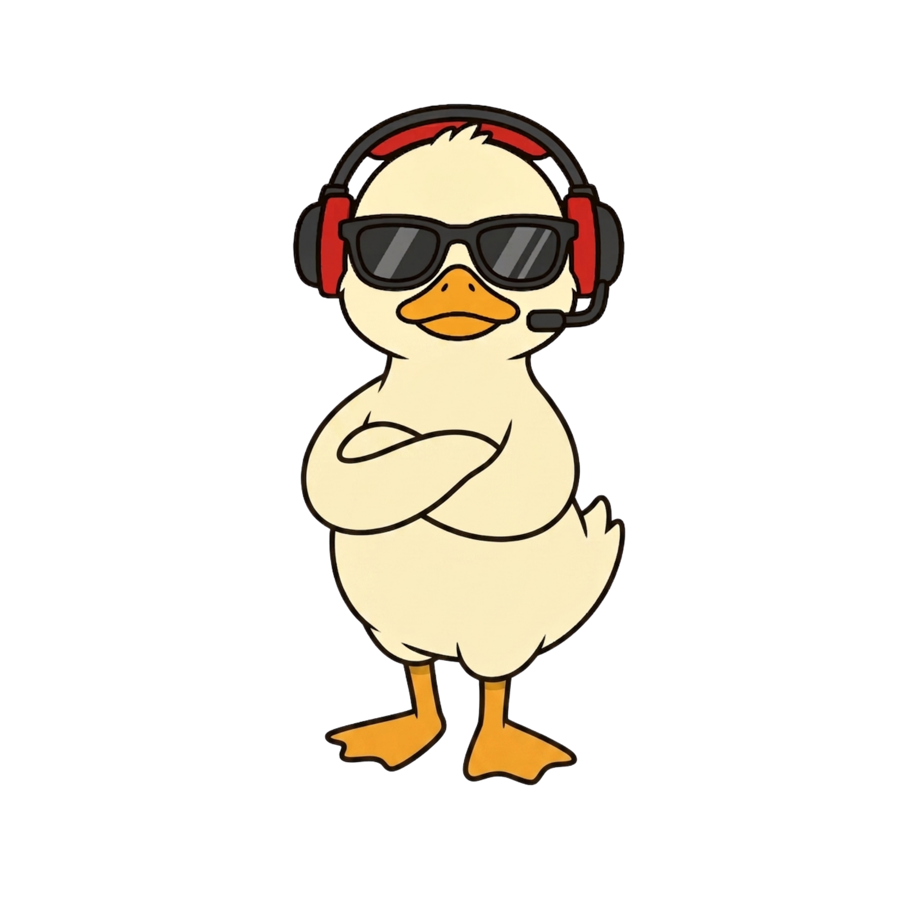
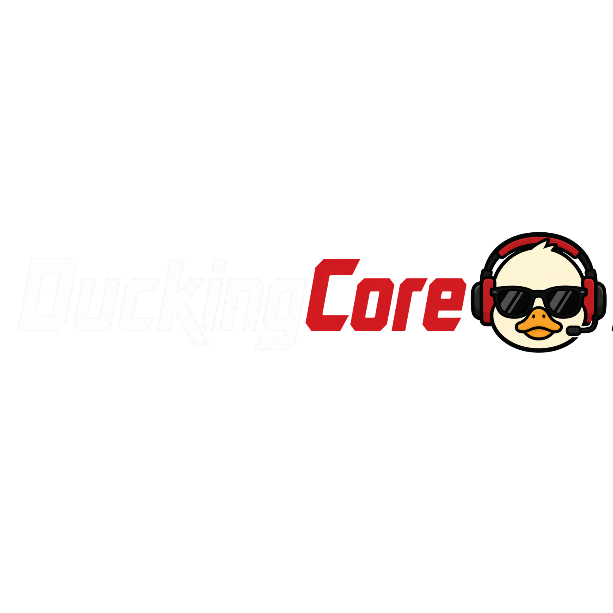

<div align="center">


<br/>


<br/>

<a href="https://www.linkedin.com/in/nehirkktn/">
  
</a>
&nbsp;
<a href="https://itch.io/">
  
</a>
&nbsp;
<a href="mailto:emailadresin@gmail.com">
  
</a>

</div>

<br/>

---

<div align="center">


</div>

<br/>

<div align="center">

</div>

<br/>

```
  ╭────────────────────────────────────────────────────────────────────╮
  │                                                                    │
  │   I don't wait. I build.                                          │
  │                                                                    │
  │   First year of university — already founded an indie             │
  │   game studio, built a 10-person team from zero,                  │
  │   and we're shipping our first game.                              │
  │                                                                    │
  │   Led multiple teams. Delivered real projects.                    │
  │   Long-term goal: build things that leave a mark.                 │
  │                                                                    │
  ╰────────────────────────────────────────────────────────────────────╯
```

<br/>

---

<div align="center">


<br/>



<br/><br/>


&nbsp;

&nbsp;


<br/><br/>

> *An indie game studio focused on creating immersive, original experiences.*
> *We don't follow trends — we set them.*

</div>

<br/>

---

<div align="center">


<br/>


</div>

<br/>

---

<div align="center">


<br/>


<br/><br/>


<br/>


</div>

<br/>

---

<div align="center">


<br/><br/>


</div>
