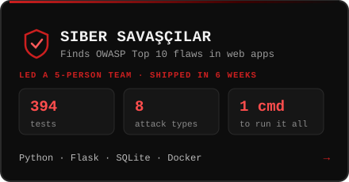
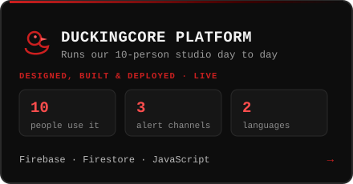
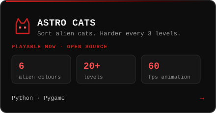
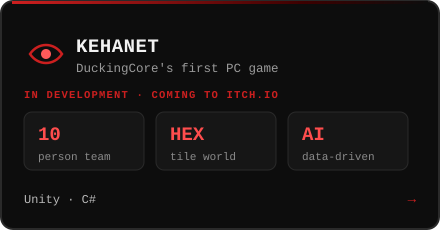

<p align="center">
  
</p>

<p align="center">
  <a href="https://www.linkedin.com/in/nehir-k%C3%B6kten-561a26377"></a>
  <a href="https://duckingcore.com.tr"></a>
  <a href="mailto:duckingcoregames@gmail.com"></a>
</p>

<p align="center"><i>I learn fastest by shipping. Everything below links to something real.</i></p>

<br>

<p align="center">
  <a href="https://github.com/Nehirkktn/penetration-testing-tool"></a>
  <a href="https://duckingcore.com.tr"></a>
  <a href="https://github.com/Nehirkktn/Astro-Cats"></a>
  
</p>

## ▸ Under the hood

<details>
<summary><b>🛡️ Siber Savaşçılar</b> — how the scanner works and what I owned</summary>
<br>

**What it does:** points at a URL and checks it against OWASP Top 10 (2021) — A01 Broken Access Control, A02 Crypto Failures, A03 Injection, A05 Misconfiguration — then writes HTML, JSON or PDF reports and keeps every scan in SQLite.

**My role:** project lead of a 5-person team — architecture, requirements, reporting plan, task breakdown. Also the top committer (72 of 127).

**Decisions I'm proud of**

- **Fails fast:** a reachability pre-check plus early abort on repeated errors means unreachable targets finish in 5–60 s instead of hanging.
- **Safe by default:** the URL validator blocks SSRF and CRLF tricks before any scan starts.
- **Extensible without code:** new checks are YAML templates (matchers on status, words, regex, headers).
- **Runs anywhere:** `docker compose up` ships Nmap and SQLMap; without Nmap it falls back to Python sockets.
- **Tested:** 394 tests, each scanner exercised against a local mock server.

<sub>Academic project — only scan systems you own or have written permission to test.</sub>
</details>

<details>
<summary><b>🦆 DuckingCore Platform</b> — the tool our studio runs on</summary>
<br>

**What it does:** the internal HQ for a 10-person studio — tasks, meetings and announcements in one place, with each member seeing only what their role allows.

**What I built**

- **Role-based permissions**, enforced both in the UI and in Firestore security rules.
- **Notifications on 3 channels:** in-panel, push (Firebase Cloud Messaging) and email.
- **TR / EN** interface, mobile navigation, password-reset flow.
- **Infrastructure:** custom domain, DNS and SSL on Firebase Hosting, set up end to end.
</details>

<details>
<summary><b>👾 Astro Cats</b> — game logic in ~500 lines of Python</summary>
<br>

- **Procedural levels:** 4 blocks per colour are shuffled into tubes plus 2 empty ones; every 3 levels adds a colour (3 → 6).
- **State machine:** menu → level select → playing → win, with locked levels that open as you progress.
- **Hand-rolled physics:** blocks lift, hover on a sine wave, glide across and drop under gravity with a capped fall speed; illegal moves send the block home.
- **Zero image assets:** the pixel logo is drawn from a bitmap font defined in code.
- **Next version:** JSON save system, solver-verified levels, star / joker economy.
</details>

<details>
<summary><b>🎲 Kehanet</b> — DuckingCore's first PC game</summary>
<br>

- **Procedural hex tilemap** world generation in Unity.
- **ScriptableObject-driven AI:** behaviour lives in data assets, so designers tune enemies without touching code.
- **Pixel-art character cards** for the cast.
- **My part:** leading the studio, setting up scenes and the team's Git workflow, reviewing the AI architecture.
</details>

<br>

<p align="center">
  
  <br><sub>Astro Cats, recorded straight from the repo's code</sub>
</p>

<br>

<p align="center">
  
  
  
  
  
  
  
  
</p>

```text
$ git log --oneline nehir
2026-09  joined Microsoft Student Ambassadors
2026     launched duckingcore.com.tr
2026     led Siber Savaşçılar — 127 commits, 394 tests, shipped
2026     started DuckingCore, grew the team to 10
2025     started Software Engineering @ Fırat University
```

<p align="center">
  <b>Next →</b> bringing hands-on build sessions to Fırat University as a Microsoft Student Ambassador.<br>
  <sub>Running a student community? <a href="mailto:duckingcoregames@gmail.com">Let's build something.</a></sub>
</p>
